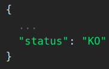
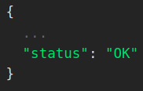

| entry point                             | summary                                                      |
| --------------------------------------- | ------------------------------------------------------------ |
| ``/ha``                                 | identify all management servers                              |
| ``/ha/diagnostic``                      | global server diagnotics                                     |
| ``/ha/audit_replication_diagnostic``    | detail diagnostic on audit replication                       |
| ``/ha/database_replication_diagnostic`` | detail diagnostic on database replication                    |
| since SMC 7.3.4, 7.4.2, and 7.5.0       |                                                              |
| ``all_servers_replication_states``      | replication state of all Management Servers in a single call |

## Check which server is active, discovering the setup

entry point: ``/ha``

**GUI equivalent:** Opening the [_SMC HA Administration_ dialog](../user-manual/gui-administration-admin-window.md).

With this entry point, you can verify whether you are connected to the active server, and if not, obtain information about which server is currently active.  
This entry point does not provide IP addresses; similar to the login window, you must already know the server IPs beforehand.

Example result:
```json
{
	"active_server": "http://127.0.0.1:8082/7.3/elements/mgt_server/10",
	"connected_server": "http://127.0.0.1:8082/7.3/elements/mgt_server/10",
	"standby_servers": [
		"http://127.0.0.1:8082/7.3/elements/mgt_server/1296",
		"http://127.0.0.1:8082/7.3/elements/mgt_server/1174"
	]
}
```
## Servers Diagnostic — Check That the System Is “OK”

entry point: ``/ha/diagnostic``

**GUI equivalent:**  [Servers diagnostic](../user-manual/gui-commands/Global%20servers%20diagnostic.md)

The server will contact all other servers and attempt to detect any issues in the current setup. The messages are written to be as clear as possible.

The key purpose of using the diagnostic is to verify, through the reported status, that the setup is correct.

| when there is at least one issue in the report | when there is no issue in the report |
| ---------------------------------------------- | ------------------------------------ |
|                    |          |

> **Warning:** A server that is down for maintenance will cause the diagnostic to report **KO**. If you need to automate actions, check the per‑server diagnostic details in the full report.

For each server there is a message block that provides information:
```json
{
			"message": [
				"    Primary IP address:192.170.56.1 / IP address in configuration: 192.170.56.1 / IP address detected by Java runtime: 127.0.1.1",
				"    Secondary IP addresses: ",
				"    Contact IP addresses: Default:192.168.56.1 VBOX:192.168.59.1 Dummy Location:192.168.56.1 ",
				"    License: 2030-12-31",
				"    Active Management Server: HOST_MGT (10)",
				" -!-  Connection with Management Server \"DK_MGT_1 DK_MGT_2\" lost.",
				"    Login status: OK  - internal server key 10 - Management IP addresses: 192.170.56.1"
			],
			"title": "HOST_MGT",
			"type": "MGT"
		}
```
## Audit replication diagnostic

entry point: ``/ha/audit_replication_diagnostic``

**GUI equivalent:** [Audit replication Diagnostic](../user-manual/gui-commands/Audit%20replication%20Diagnostic.md) -- includes an explanation of the diagnostic information.

Example on the Active Server shortly after startup:
```json
{
	"server_name": "HOST_MGT",
	"status": true,
	"last_error": "Active server - listening",
	"state": "Listening",
	"last_update": 1769788369836,
	"info": "Active server mode has been enabled",
	"input_files_count": 3,
	"output_files_count": 10
}
```
## Database replication diagnostic

entry point: ``/ha/database_replication_diagnostic``

**GUI equivalent:** [Database replication Diagnostic](../user-manual/gui-commands/Database%20replication%20Diagnostic.md) -- includes an explanation of the diagnostic information.

Example on the Active Server:
```json
{
	"server_name": "HOST_MGT",
	"valid_license": true,
	"servers": "[HOST_MGT (10), DK_MGT_2 (1296), DK_MGT_1 (1174)]",
	"state": "[ACT_REP] Active database replication is enabled",
	"table_count": "371",
	"element_count": "1428",
	"active_server_publication": true,
	"standby_server_registered": "2",
	"active_replication_streaming": "2",
	"active_replication_to_standby_servers": [
		"[PG-PUB|-->127.0.0.1  on port 50014|sub_smc1174|pid:289006|Since:2026-02-17 16:26:20+0100",
		"[PG-PUB|-->127.0.0.1  on port 51562|sub_smc1296|pid:217987|Since:2026-02-17 15:24:32+0100"],
	"standby_replication_subscription": "0"
}
```

## All servers database replication state

entry point: ``all_servers_replication_states``

>**Available since SMC 7.3.4, 7.4.2, and 7.5.0.**  
  For older versions, use `/ha/database_replication_diagnostic` on each server individually.

**GUI equivalent:** Opening the [_SMC HA Administration_ dialog](../user-manual/gui-administration-admin-window.md).

**Available only on the Active Server.**  
The REST Client must be connected to the Active Server to initialize to perform this request.

This entry point retrieves the replication state of all Management Servers in a single call.  
It removes the need to connect to each server individually to request a database replication diagnostic.

This call can also be used to monitor the progress of a new server activation or a standby server initialization.

Example:
```json
{
	"active_server_state": "[ACT_REP] Active database replication is enabled",
	"standby_server_states": [
		{
			"server_name": "DK_MGT_2",
			"state": "[STB_REP] Standby database replication is enabled"
		},
		{
			"server_name": "HOST_MGT",
			"state": "[STB_REP] Standby database replication is enabled"
		}
	]
}
```
