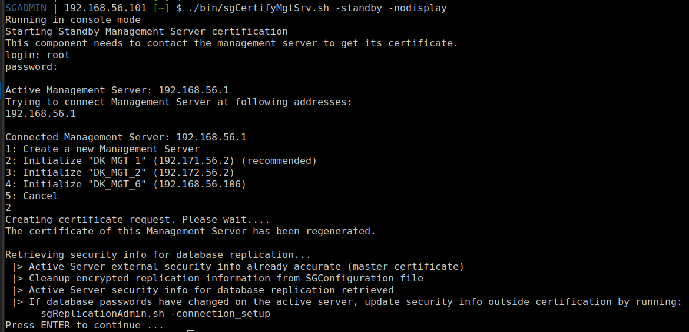

[back to all console commands](../command-line-administration.md)

Prerequisite:
- Active management server must be online
- Standby management server must be stopped.

>**Note:** When a management server is installed as a standby management server, the initial certification is automatically attempted during installation.  
> However, if the certification fails (for example, if the active management server is unreachable or shut down), the installation will still complete successfully. In this case, certification must be performed manually later using the command line.
> **GUI administration is only possible after the standby server has been successfully certified**.

Standby server certification is performed using the same command as single or active server certification, `sgCertifyMgtServer`, but with different parameters.

The main parameter is `-standby`.

During the certification process, an existing management server must be bound to the standby server instance. This management server can either already exist or be created during the certification process when running the command in interactive mode.

```
sgCertifyMgtSrv.sh -standby active-server=<Active server IP> login=<root user> pass=<root user password> standby-server=<Existing Management Server Name>
```
> **Warning:** Using passwords directly on the command line is not recommended.

> If the management server does not already exist, you must use interactive mode; otherwise, the command will fail.

Execution example without parameter:

