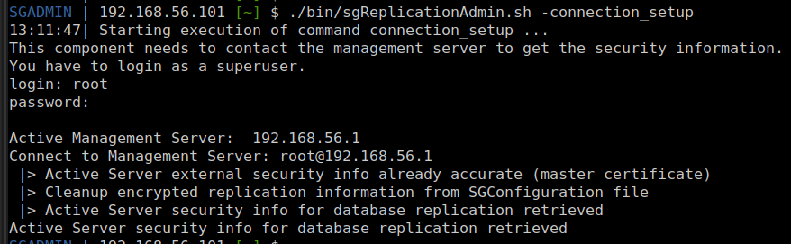

[back to all console commands](../command-line-administration.md)

If the server is already certified but the replication credentials have been updated (most commonly using `sgReplicationAdmin`), you can update the security information accordingly.

Prerequisite:
- Active management server must be online
- Standby management server must be stopped.

All parameters are optional; however, if none are provided, the script runs in interactive mode and prompts for the required information.
```
sgReplicationAdmin.sh -connection_setup [host=<Active Management Server address] [login=<root user on SMC>] [pass=<user password]
```
> **Warning:** Using passwords directly on the command line is not recommended.

Execution example without parameter:


