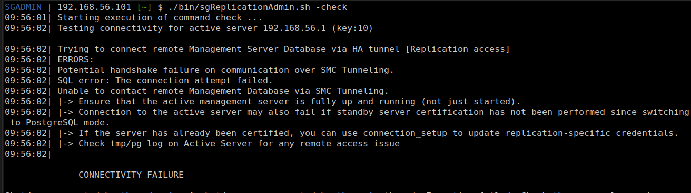

[back to all console commands](../command-line-administration.md)

This command is used to validate native replication connectivity. It ensures that:

- The standby server is properly certified
- Secure (tunneled) communication between management servers is correctly configured, and the active server tunnel is online.
- Replication security credentials are valid

```shell
sgReplicationAdmin.sh [-check active-server=<server ip> active-server-key=<internal key>]
```

# Fast check (no parameter)
> **Note:** This option is available only starting from SMC **7.3.4**, **7.4.2**, and **7.5.0**.  
Earlier SMC versions support only the custom check, where parameters are mandatory.

When run without parameters, the command verifies the setup used during the last certification, connection setup, or replication initialization.
```shell
sgReplicationAdmin.sh -check
```

# Custom check
Example with all parameters:
```shell
sgReplicationAdmin.sh -check active-server=192.168.56.1 active-server-key=10
```
> Both parameters are mandatory if either one is specified.

**How to find the active server key**

Execute the following command:
```sh
sgReplicationAdmin.sh -status  
```
The command output contains a JSON object listing all management servers and their corresponding internal keys.
Ex:
```json
"Management Servers" : " HOST_MGT (10) DK_MGT_2 (1296) DK_MGT_6 (1486) DK_MGT_1 (1174)"
```

If the command is run on a standby server that may not be fully synchronized with the active server, run the command on the active management server instead.

# Example output

> Failure

> success

