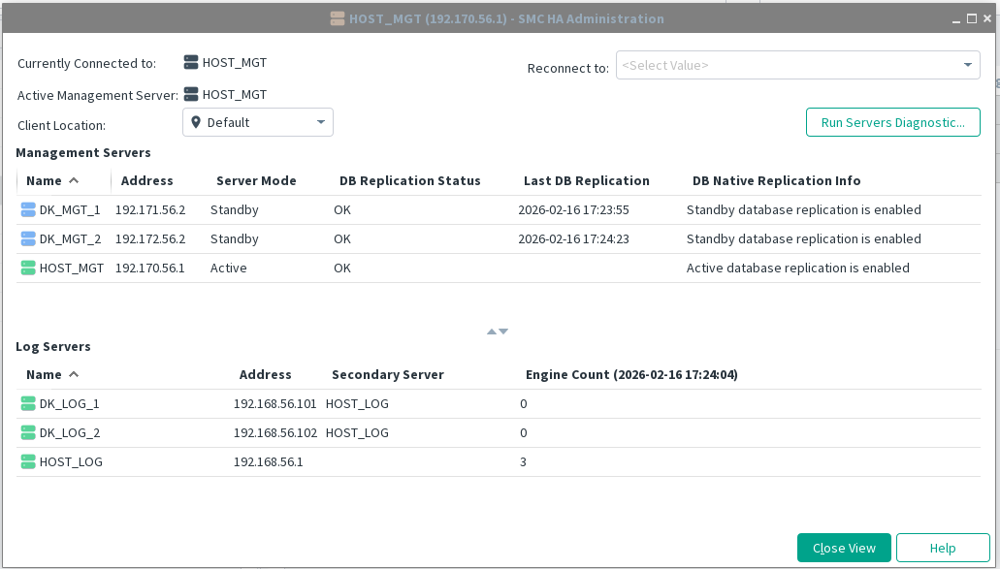
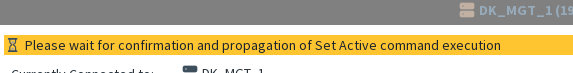
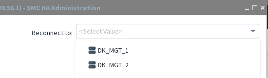
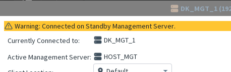
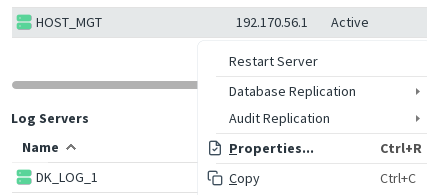
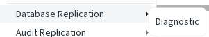
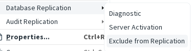
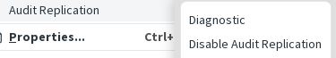
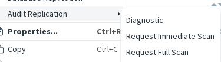

> [How to open it ?](gui-administration-main-window.md)

When this dialog is open, information from all servers is aggregated to provide improved monitoring for the HA Administration feature. **The status of each server is evaluated before any command is executed**.

> **Note:** Using direct command‑line operations does not offer this protection. Therefore, using the Management Client is strongly recommended instead of running console commands individually on each server.

When an action that modifies the HA setup is executed, **all refreshes and interactions in the window are temporarily blocked for 10 to 30 seconds** (depending on the action). This delay ensures that SMC Monitoring has enough time to detect and reflect the impact of the change.

# Header
## Currently Connected to
When administrating HA, you should always be connected to the Active Server except when you want to do a fail over to another standby server, you should be connected to this other server.
### Reconnect to
If you are not connected to the active server or just want to check another server, do not log off or use another client; just use "Reconnect to"

## Active Management Server
Identify which server is the active one. This should be immediately visible, especially in cases where replication issues occur.

If you are connected to a Standby Server, a warning banner is displayed.

## Client location

If servers use different IP addresses depending on their location, ensure you are aware of the current location. The HA Administration dialog cannot operate unless all servers are reachable.
##  Servers diagnostics

See [Servers diagnostic](gui-commands/Global%20servers%20diagnostic.md)
# Management Servers table
The  columns title are expected to be self‑explanatory. Key points:
- **address** refers to the server’s main IP address, not the contact address. Depending on your setup or location, this may not be the IP you can reach.
- **DB Replication status** reflects only the PostgreSQL replication state. _OK_ means that native database replication is functioning, but the overall server status may differ if issues occur outside database replication.
- **Last DB Replication data** is taken directly from PostgreSQL’s internal replication system tables.

HA Administration is done using contextual popup menu on each server.
### Menu

Restarting the server is allowed on the Active Server, but it is not recommended.  
**Properties…** and **Copy** are available in any context where Management Servers are visible.

The section below describes the common menu entries that appear in most situations. For a complete list of all actions available from the contextual menu, see [HA Administration commands](gui-administration-admin-commands.md)
#### Database Replication (Active Server)

By default, only the diagnostic action is available on the Active Server. Depending on the current system state, additional commands may become available.

see [HA Administration commands](gui-administration-admin-commands.md) for more detail on each commands
#### Database Replication (Standby  Server)

**Server Activation** opens a wizard that activates the selected server. This action must be used when connected to a Standby Server. If executed from an Active Server, a warning is displayed.

**Exclude Server** should be used when a server will be shut down for maintenance.  
⚠️ **Important:** A server that is offline but _not_ excluded will negatively impact the performance of the Active Management Server. 

see [HA Administration commands](gui-administration-admin-commands.md) for more detail on each commands
#### Audit Replication (Active Server - if enabled)

- [Diagnostic](gui-commands/Audit%20replication%20Diagnostic.md)
- [Disabling Audit Replication](gui-commands/Disabling%20Audit%20replication.md)
#### Audit Replication (Standby Server)

- [Diagnostic](gui-commands/Audit%20replication%20Diagnostic.md)
- [Immediate Scan](gui-commands/Audit%20scan.md)
- [Full Scan](gui-commands/Audit%20full%20scan.md)
# Log Servers table

Log Servers are not part of HA Management.  
However, Log Servers have their own HA feature related to engine connections. This table provides a quick way to check:

- which secondary Log Servers are associated with each Log Server
- how many engines are handled by each Log Server  
    (This count must be explicitly requested, as it is a dynamic check and rarely needed. It can be triggered from the table’s contextual menu using **Refresh engine count**.)
