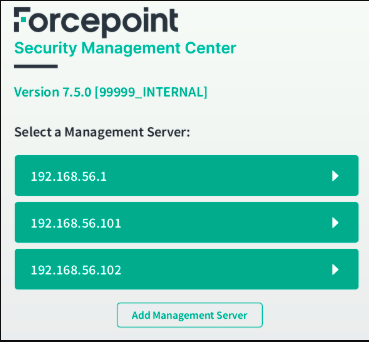
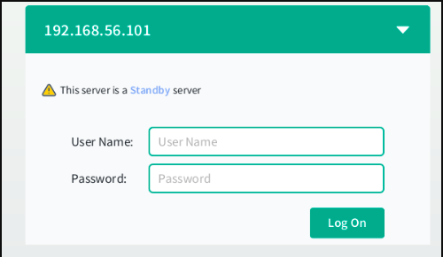

# Connection
The Management Server client is expected to be opened on the Active Server, but it can also be opened on a Standby Server. In that case, a warning will appear in the login window.

The system does not automatically suggest the IP addresses of all Management Servers. However, once the IP addresses are entered (using button ``Add Management Server``, they are retained.

A warning is displayed when the selected server is a Standby Server.

