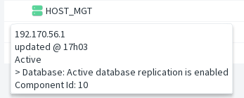
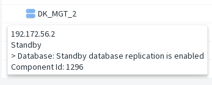
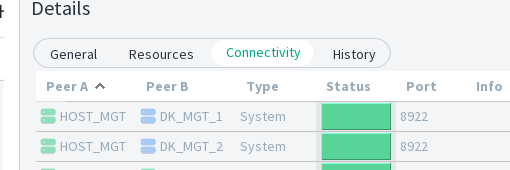
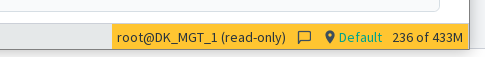
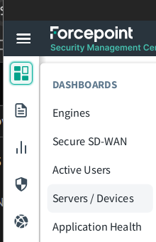
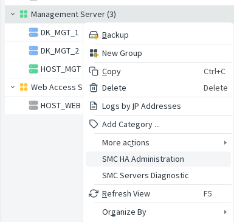

Within the main window, the status of the servers is visible through the standard monitoring view.

- If replication begins to misbehave, a warning may appear.
- If replication is broken, a red exclamation mark is displayed.

Note that the Management Server status may be degraded for reasons unrelated to replication.  
When replication is the cause, a specific message will be shown in the tooltip.

| Active Server                        | Standby Server                        |
| ------------------------------------ | ------------------------------------- |
|  |  |

Within the connectivity information panel, the server is often visible using port **8922**. If it is not visible at all times, this is normal and not an issue.

## When connected on Standby Server

The GUI is opened in read‑only mode. It reflects changes made in the database, but may occasionally require a manual refresh.

# Opening HA Administration dialog

Always available on any server type, as long as the system is configured for HA.

| Open the Servers / Devices dashboard                              | Menu "SMC HA Administration" is available on each Management Server and Root Management Server. |
| ----------------------------------------------------------------- | ----------------------------------------------------------------------------------------------- |
|  |                                        |

To continue -> [SMC HA Adminstration](gui-administration-admin-window.md)
