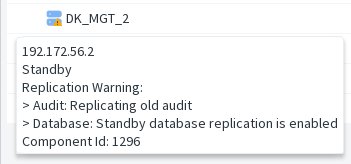

[back to all administration commands](../gui-administration-admin-commands.md)

> This command is available from the _Audit Replication_ submenu in the contextual menu of a **Standby** Management Server within the [HA Administration window](../gui-administration-admin-window.md).

Refer to the  [HA Administration](../gui-administration.md) section for a high‑level overview of audit replication and its role within HA Management.

Audit replication runs at a low frequency on the Standby Server.

Triggering a **full scan** resets the replication history, causing the entire audit file structure to be checked.  
Audits are **not replicated again**; the scan only verifies that no audit files are missing.

When launching a full scan, you can choose to run it **as fast as possible** or let it proceed at the **normal background pacing**.  
Running it as fast as possible may increase the load on the Active Management Server and the network.

### When should you use a full scan?

- When you have restored older audit files and need them to be included in the searchable audit history.
- After setting up a new Standby Server, to avoid staying in _“Replicating old audit”_ for several days.

 
 
 > **Note:** This message may remain visible for a few minutes during Standby Server startup. Replication runs at low priority and at a reduced pacing.
 