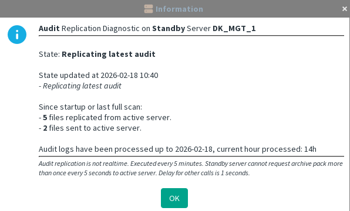

[back to all administration commands](../gui-administration-admin-commands.md)

> This command is available from the _Audit Replication_ submenu in the contextual menu of a Management Server within the [HA Administration window](../gui-administration-admin-window.md).

Refer to the  [HA Administration](../gui-administration.md) section for a high‑level overview of audit replication and its role within HA Management.

⚠️ Audit replication is not real time. This is executed once by hour on a default setup.
## Diagnostic on Standby Server

Standby Servers process audit replication **slowly and continuously in the background**.  
The normal operating state is **`Replicating latest audit`**.

If a full scan has been requested, the state changes to **`Replicating old audit`**.

The diagnostic view provides timing information and statistics about data retrieval and transfer activity.

Audits are stored **per hour**, which is why the current hour is highlighted.  
On a newly deployed Management Server, replicating old audits can take significant time unless a full scan is explicitly requested.

**Example:** Diagnostic output on a Standby Server:

## Diagnostic on Active Server

Audit replication is managed by the **Standby Server**.  
The **Active Server** simply responds to requests coming from the Standby Server.

The Active Server is considered healthy when it is in the **`listening`** state, meaning it is ready to receive file requests or audit data from the Standby Server.

- **files requested** — the number of audit files requested by Standby Servers since the Active Server was started.
- **files received** — the audit files sent by the Standby Server.

**Example:** Diagnostic output a few minutes after the Active Server startup:

