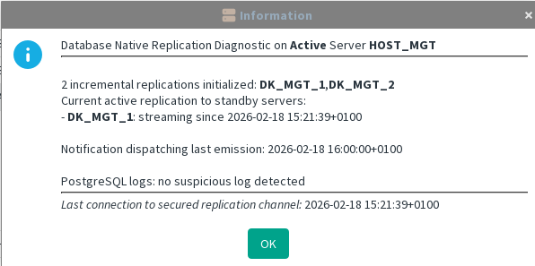
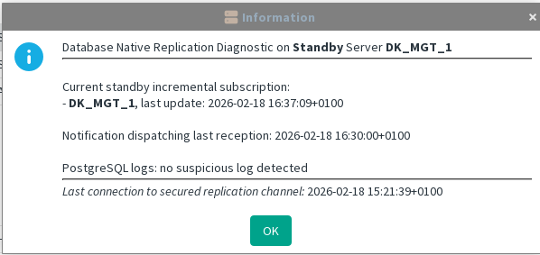

[back to all administration commands](../gui-administration-admin-commands.md)

> This command is available from the _Database Replication_ submenu in the contextual menu of a **Standby** Management Server within the [HA Administration window](../gui-administration-admin-window.md).

The replication diagnostic relies on information retrieved from PostgreSQL system tables.

Detection of PostgreSQL log anomalies is heuristic‑based and is intended to highlight unexpected log entries that appear across all servers. This information may be less relevant after a server restart or when the replication configuration has recently been updated.

---
## On the Active Server

- **Number of initialized incremental replications**  
    This value matches the number of Standby Servers registered for incremental replication.
    
- **Number of active replications**  
    This corresponds to the number of Standby Servers currently connected, followed by their detailed list.
    
- **Notification dispatching**  
    This subsystem enables automatic event propagation to Standby Servers and supports GUI operations performed from clients connected to a Standby Server.
    
- **Secure communication channel**  
    The secure channel must be active on the Active Server.  
    If no connection is established, and Standby Servers are running, it indicates that they failed to connect. note that the connection time is not the last exchange. 

In the example below, two Standby Servers are registered, but only one of them is currently running:

## On the Standby Server

- **Active replication**  
    An active subscription is expected on any properly configured Standby Server.
    
- **Notification reception**  
    Same purpose as on the Active Server.
    
- **Secure communication channel**  
    Same purpose as on the Active Server.

A normal diagnostic on a Standby Server:

