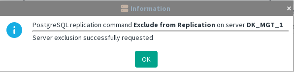

[back to all administration commands](../gui-administration-admin-commands.md)

> This command is available from the _Database Replication_ submenu in the contextual menu of a **Standby** Management Server within the [HA Administration window](../gui-administration-admin-window.md).

This command appears only when the incremental replication is properly declared on active server. 

**Stops the replication setup for this server on both the Active Server and the Standby Server.**  
This action is available even if the Standby Server is offline, allowing the system to properly terminate the replication relationship. This prevents the Active Server from consuming resources attempting to replicate to a Standby Server that will not restart.

The execution is  immediate and a dialog confirm the execution

