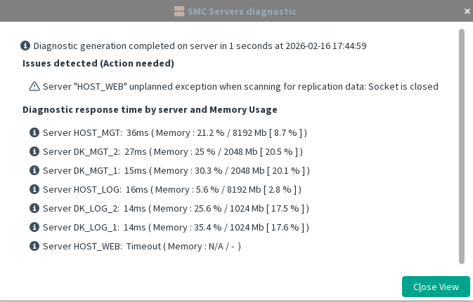

[back to all administration commands](../gui-administration-admin-commands.md)

> Available from the HA Administration dialog

This action contacts all servers and attempts to detect any issues in the current setup. The messages are designed to be as understandable as possible.

In the example below, the server **HOST_WEB** is either not running or not reachable.

