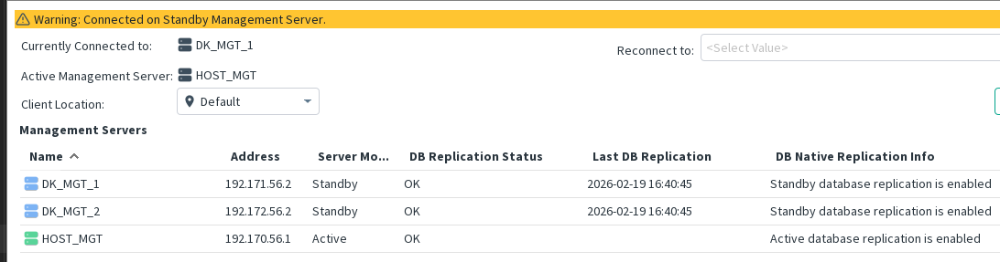
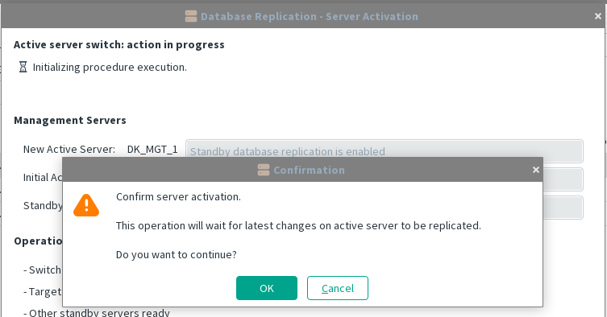
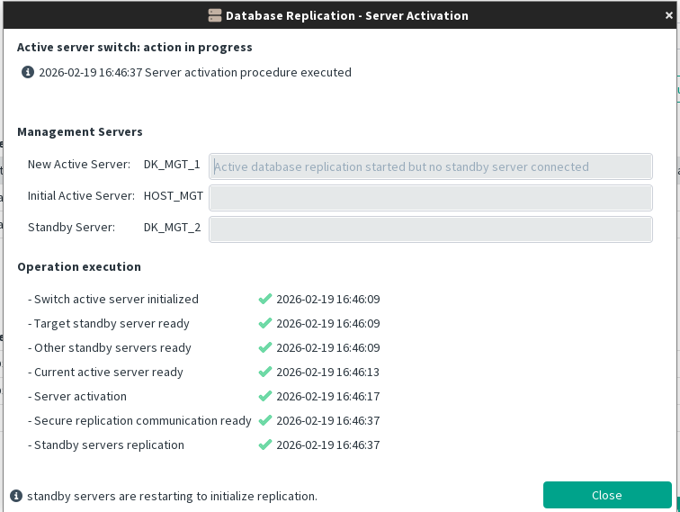
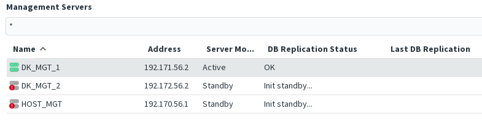

[back to all administration commands](../gui-administration-admin-commands.md)

> This command is available from the _Database Replication_ submenu in the contextual menu of a **Standby** Management Server within the [HA Administration window](../gui-administration-admin-window.md).

**Important notice:**  
The activated Management Server will **not** be restarted.  
**All Standby Servers will be restarted** as part of the procedure.

The starting point for any new server activation is a **stable system**.  
The HA Administration dialog must be connected to the server that will be activated (a Standby Server).

The **Server Activation** menu is a context menu displayed on the server that you intend to activate (sub menu Database Replication)

**Final confirmation:**  
Once the activation is running, the Management Server enters a **special state**.  
The current Active Server is temporarily set to **Standby**, with replication continuing until all pending changes have been fully replicated.

The wizard displays the progress of the activation through several steps. If the procedure fails, the step at which it stops indicates the current state and helps determine the appropriate corrective action.  
See: [how to react if activation wizard is aborted](../troubleshooting/server-switch-interrupted.md).

At the end of the procedure, you may choose to delay the initialization of the Standby Server. This is allowed but **not recommended**.

Once the dialog is closed, keep in mind the initialization of the standby server to adapt to the new active server is in progress.

