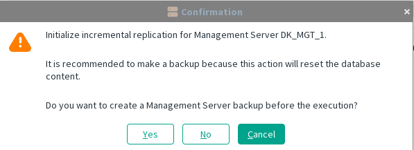
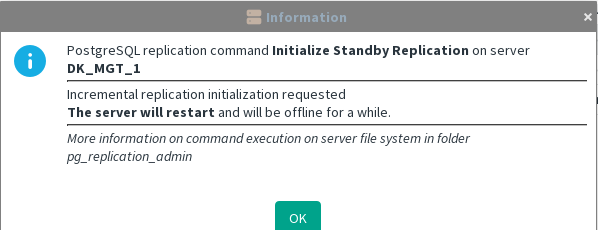
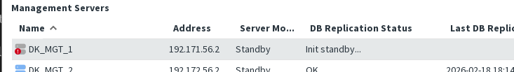

[back to all administration commands](../gui-administration-admin-commands.md)

> This command is available from the _Database Replication_ submenu in the contextual menu of a **Standby** Management Server within the [HA Administration window](../gui-administration-admin-window.md).

Available only when the server has not yet been initialized.  
To run this initialization again, the server must first be properly excluded.

You can optionally choose to create a backup of the Standby Server before starting the initialization.

There is no specific recommendation to perform a backup at this stage, but you may choose to do so if you prefer.

The initialization process runs in the background and can take some time to complete.

During the initialization process, the Standby Server will restart twice:

- **First restart:** to complete the initial setup

- **Second restart:** to start in Standby mode

If the replication status is not **OK** after the final restart, the diagnostic view will not provide useful information, as it will only show that the replication declaration is missing.

In this situation, you must connect to the server in **console mode** to investigate the issue.
See [Active server connectivity issue](../troubleshooting/cannot-access-active-server.md).