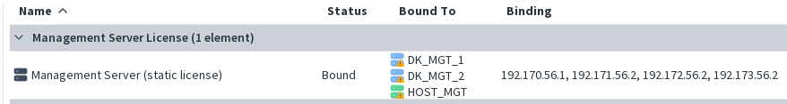
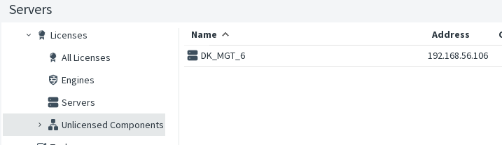

A dedicated license is required to use the HA Management Server feature. This license covers multiple servers and must be installed **only on the Active Management Server**.

**Important:** The Management Server IP addresses are included in the license. Any network changes that modify these IPs must be planned in advance.

> **Since versions 7.5.0, 7.4.1, and 7.3.3:**  
> Replication is enabled on the Standby Server even without HA licenses. However, the Standby Server cannot take over control until a valid license is installed.  Monitoring will also be unavailable for a server that does not have a valid license.
> _(This replication operates as a real‑time incremental backup.)_

If the Standby Server IP is not included in the license, the server will appear under **Unlicensed Component**.

