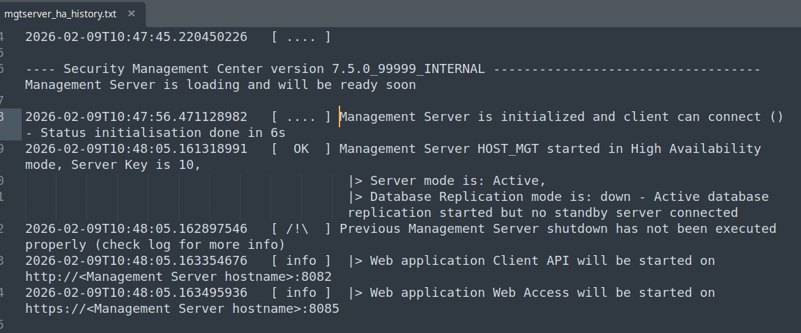

# Troubleshooting Guide

This guide helps you diagnose and resolve common issues with SMC High Availability.
## Diagnostics

The SMC Client provides diagnostics to identify HA‑related issues, including connectivity problems, replication status, and role consistency between Management Servers.

- [global server diagnostic](gui-commands/Global%20servers%20diagnostic.md)
- [database replication diagnostic](gui-commands/Database%20replication%20Diagnostic.md)
- [audit replication diagnostic](gui-commands/Audit%20replication%20Diagnostic.md)

> This diagnostic evolves over time and with each SMC version. It aims to cover known issues and help resolve problems caused by “natural events” such as certificate or license expiration, user errors, network issues, and similar situations.
## Known cases

This section lists common HA failure scenarios and provides guidance for identifying and troubleshooting them.

The [Database replication state](database-replication-states.md) is the best starting point for determining the appropriate corrective action when the replication state is not OK.

| List of known setup issue                                                                                                                                            |
| -------------------------------------------------------------------------------------------------------------------------------------------------------------------- |
| [Replication on hold / No standby initialized](troubleshooting/no-standby-server-initialized.md)                                                                     |
| [Replication on hold](troubleshooting/standby-server-on-hold.md)                                                                                                     |
| [Server not accessible](troubleshooting/server-not-accessible.md)                                                                                                    |
| [PostgreSQL error shown in diagnostic or status](troubleshooting/postgresql-log-error-in-replication-or-status.md)                                                   |
| [Standby server connectivity issue with active server](troubleshooting/cannot-access-active-server.md)                                                               |
| [Server switch failure or interrupted](troubleshooting/server-switch-interrupted.md)                                                                                 |
| [Server start failure after a violent interruption of an _Init‑standby_ or _restore‑backup_ operation](console-commands/advanced-commands/reset%20server%20setup.md) |
| [Split brain condition ( more than one active server )](troubleshooting/split-brain-setup.md)                                                                        |
| [Replicating old audit warning](gui-commands/Audit%20full%20scan.md)                                                                                                 |
## Log Files

All Management Server–related log files are located in the installation’s `tmp` directory.

On Linux, the default path for all log files is:
```
/usr/local/forcepoint/smc/tmp/
```

These files are also automatically included in the `sgInfos` package generated for the Management Server. 
###  Management history

A single file named `mgtserver_ha_history.txt` is available in the installation temporary directory.  
This file is updated by the management server and its content is preserved over time.

Server startups and major administrative command executions are logged chronologically, making it useful for understanding the evolution of the HA setup.


### administration command history

The `tmp/pg_replication_admin` directory contains JSON reports for each replication administration command that has been executed.  
Each report file is timestamped.
### replication administration logs

The `sgReplicationAdmin` command runs under the application ID `PGREPLICATION`.  
As a result, each execution generates log files in the same way as other SMC components.
### postgresql log

PostgreSQL native logs are available in the `tmp/pg_log` directory. However, interpreting these logs requires in‑depth knowledge of SMC internal behavior.  
In some cases, fatal errors reported in these logs do not indicate an actual issue.

> **Warning:** PostgreSQL log entries can be complex to interpret. Some errors reported in the logs are expected and do not represent problems for SMC.  
SMC includes built‑in replication diagnostics that parse and filter PostgreSQL logs to detect relevant issues. **Direct inspection of PostgreSQL log files is therefore not recommended.**
### management logs

Standard management server logs may also contain extensive replication‑related information. These logs are located in the `tmp` directory, in files whose names contain `MGTSRV`.

Replication messages are logged under the category `stonesoft.util.db.postgresql.replication`. 
Most log entries related to replication administration start with the prefix `PG-Admin`.