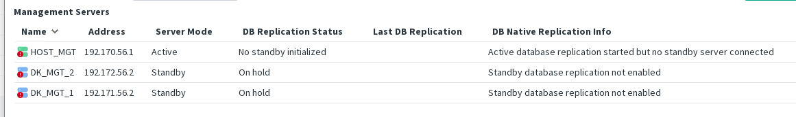
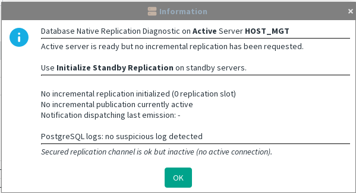

> DB Replication Status: No standby initialized / On hold

This state can appear following a fresh installation, an upgrade, or the restoration of a backup. The system is not malfunctioning; it is simply not yet initialized.

The Active Server diagnostic will indicate that no Standby Server is currently declared.

Just use [Standby server initialization](../gui-commands/Standby%20server%20initialization.md) on each standby server.