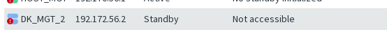

> DB Replication Status: Not accessible

The Client must be able to reach each Management Server individually. Connectivity to the Active Server alone is not sufficient to administer HA.

Verify the location and contact address of each Management Server to ensure the setup is correct. A common issue is a contact address that is not reachable from the Management Client.