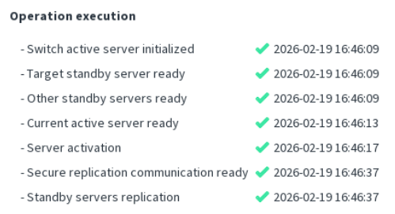

Server activation is executed through a strict, predefined sequence of steps.

## Recovery Scenarios When the Activation Wizard Is Interrupted

### 1. Failure **before** _“Current Active Server Ready”_

If the failure occurs before reaching **Current active server ready**, the previous Active Server is still considered Active, but the system is in an inconsistent state.

A menu option should be available to restore the server back to **Active** mode.

For each Standby Server:

- If the **Exclude** menu is available → **exclude the server**
- Then **run the Init‑standby procedure** again for each Standby Server

---
### 2. _“Current Active Server Ready”_ **confirmed**, but _“Server Activation”_ **not confirmed**

In this case, the switch was safe to execute, and the Server Activation step may or may not have completed.

#### If the **target server is Active**

The switch has succeeded but is incomplete.  
You must run the **Init‑standby** procedure on **all Standby Servers**.

#### If **no Active Server** is present

Select one server to activate.  
A menu option should be available to **force activation**.  
After activation, run **Init‑standby** on all Standby Servers.

---
### 3. Interruption **after** _“Server Activation”_ confirmed

If the interruption happens after the **Server Activation** step is confirmed, the activation procedure is considered **completed**.

Then:

- Check each Standby Server
- If the **Initialize Standby Server** menu is available → execute it

No additional recovery steps are required.
