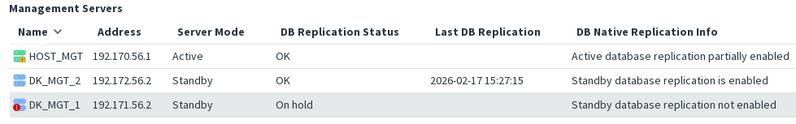
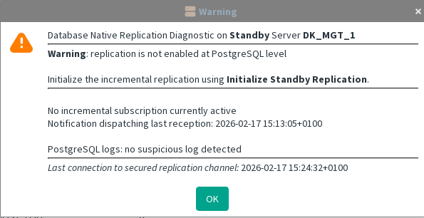

> DB Replication Status: OK / On hold

The Active Server is OK and at least one Standby Server is also OK. From the HA Management Service perspective, the setup is considered valid.

But one Standby Server is not initialized.

> Known situations that lead to this state include:
>- the Standby Server has never been initialized, or
>- the Standby Server was excluded while it was offline.

1. First, check whether **“Exclude Server”** is available. If it is, exclude the server properly.  
This indicates that the server was previously connected, but replication on the Standby Server has been stopped (for example due to console commands, backup restoration, or other possible causes).
2. Then run [Standby server initialization](../gui-commands/Standby%20server%20initialization.md) on standby server.
If initialization fails, see [Standby initialization failure](cannot-access-active-server.md)

